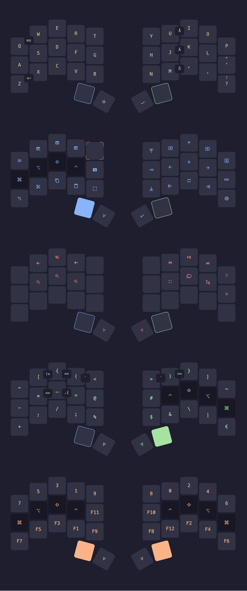

## Tabber

Tabber works similarly to Callum’s Swapper by holding the modifier key while active.

When inactive, it sends an alternate key combination (e.g. Ctrl+Tab) instead of the the active key combination (e.g. Alt+Tab).

Once activated, and after a tabbing action is triggered, the activator key functions as a repeat key.

> Keymap drawer CSS by bravekarma
